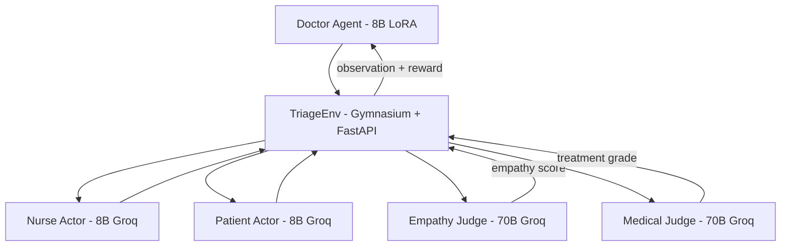

#  Multi-Agents for Clinical Decision Making

> **What happens when you drop an 8B LLM into a chaotic Emergency Room, surround it with simulated patients and nurses, and force it to learn medicine through trial by fire?**

Built for the [Meta × PyTorch OpenEnv Hackathon — April 2026](https://pytorch.org/blog/openenv/).

  

---

##  Quick Links

| Resource | Link |
|:---|:---|
|  **Live Environment (HF Space)** | [huggingface.co/spaces/Uddiii/Multi-Agentic](https://huggingface.co/spaces/Uddiii/Multi-Agentic) |
|  **Engineering Deep Dive (Blog)** | [`blog.md`](./blog.md) |
|  **Demo Video** | [YouTube](https://www.youtube.com/watch?v=hL7n5TU7Bm4) |
|  **Training Notebook** | [Kaggle](https://www.kaggle.com/code/aman99123/grpo-rl-trainer) |
| **Baseline Evaluation** | [`baseline_eval/`](./baseline_eval/) |

> **Suggestion: START WITH THE [BLOG](./blog.md)** — it's a 5-minute read that explains why standard medical AI benchmarks fail and what our environment does differently in a non-technical interesting manner.

---

## 1. Problem Statement

Most "medical-LLM" benchmarks ask a frozen model to one-shot a multiple-choice question. Real emergency medicine is nothing like that. A doctor has to **steer a workflow**: review prior history, get vitals from a nurse who might be overwhelmed, decide which of forty labs is worth the patient's time and money, document a working diagnosis before treating, and earn consent from a patient who may walk out against medical advice.

**The capability gap we target is process-level clinical competence under uncertainty** — the ability to make a sequence of tool-use decisions with imperfect information, while balancing diagnostic accuracy, time, cost, and patient trust.

This needs an **environment**, not a static benchmark, and it needs **dense, multi-component, hack-resistant reward structures**, not a single accuracy score.

---

## 2. Environment

A multi-agent simulation implemented via Gymnasium and served via a FastAPI HTTP server (OpenEnv-compatible). The environment features a unique **Quad-Agent Architecture**:



### The Actors
| Agent | Role | Model | Key Behavior |
|:---|:---|:---|:---|
| **Doctor** | RL Trainee | 8B LoRA (Unsloth) | Explores tools, diagnoses, prescribes |
| **Nurse** | Cooperative Colleague | 8B-Instant (Groq) | Executes orders, reports vitals |
| **Patient** | Adversarial Actor | 8B-Instant (Groq) | Hidden trust/anxiety state, can refuse or leave |
| **Empathy Judge** | Per-Message Evaluator | 70B-Versatile (Groq) | Grades Doctor's communication tone |
| **Medical Judge** | Terminal Evaluator | 70B-Versatile (Groq) | Grades treatment accuracy, flags lethal prescriptions |

### Domain Randomization
- **50 diseases** across 10 clinical classes (Cardiovascular, Trauma, Toxicology, Endocrinology, etc.)
- **17,280+ unique persona combinations** from 5 Patient axes × 4 Nurse axes
- **3 difficulty tiers** with phase-aware SOAP noise injection

### ElevenLabs Emotion TTS
A TTS adapter injects emotion tags (`[sigh]`, `[nervous]`, `[hostile]`) based on the Patient's hidden state, producing expressive real-time audio during the dashboard demo.

---

## 3. Capabilities

The Doctor is given **five strict JSON tools**. Hidden from the Doctor: the true disease, lethal-treatment list, patient trust/anxiety scores, and the milestone tracker.

```json
{"tool": "read_soap", "section": "ALL"}
{"tool": "speak_to", "target": "patient", "message": "..."}
{"tool": "speak_to", "target": "nurse",   "message": "..."}
{"tool": "order_lab", "test_name": "troponin"}
{"tool": "update_soap", "section": "Assessment", "content": "..."}
{"tool": "terminal_discharge", "treatment": "...", "is_emergency": true}
```

**Clinical Constraints:**
- **Consent Lock**: Treatment rejected if patient hasn't consented (Phase 2+)
- **Workflow Milestones**: Expected order — `READ_SOAP → PATIENT_CONTACT → VITALS → LABS → ASSESSMENT → DISCHARGE`
- **Emergency Classification**: Doctor must flag time-critical cases

---

## 4. Tasks — 3-Phase Curriculum

| Phase | Name | Difficulty | What Success Looks Like |
|:---|:---|:---|:---|
| 1 | **Tool Mastery** | Easy | Doctor reads SOAP, talks to patient, orders the critical lab, writes Assessment + Plan, discharges correctly. |
| 2 | **Clinical Reasoning** | Medium | SOAP is noisy. Patient is anxious or confused. Doctor must do differential reasoning, not pattern-match. |
| 3 | **Empathetic Negotiation** | Hard | Patient is hostile or non-compliant. Consent is required. Doctor must earn trust or risk an AMA penalty. |

---

## 5. Reward Model / Evaluation Logic

> **Process > Terminal.** Process rewards (~60% of max) dominate terminal rewards (~40% of max). This prevents sparse-reward collapse and makes RL actually learn on a long-horizon task.

| Component | Range | What It Captures | Computed By |
|:---|:---|:---|:---|
| `process` | +0.05/step | JSON-validity, tool-legality | Rule (env) |
| `milestones` | +0.03 to +0.07 | Ordered clinical workflow | Rule |
| `labs` | +0.20 / −0.20 | Critical vs redundant lab choice | Rule + DB |
| `diagnosis` | +0.20 / +0.30 | Assessment accuracy vs true disease | Rule |
| `plan` | +0.15 / +0.25 | Plan accuracy vs correct treatment | Rule |
| `documentation` | +0.08/step | SOAP completion | Rule |
| `empathy` | capped ±0.30/−0.40 | Doctor's communication quality | **70B Empathy Judge** |
| `consent` | +0.25 / −0.50 | Patient AGREE vs AMA outcome | Rule + Patient LLM |
| `emergency_id` | ±0.30 | Emergency classification accuracy | Rule |
| `treatment` | [−0.30, +0.60], −0.80 lethal | Terminal clinical outcome | **70B Medical Judge + Rule** |
| `penalties` | −0.01 to −0.30 | Turn cost, invalid JSON, early discharge | Rule |

### Anti-Reward-Hacking
1. **Dual-Verifier Treatment**: 70B Medical Judge + deterministic keyword verifier (60/40 blend)
2. **Empathy Farming Cap**: Hard-capped at +0.30/episode
3. **Smooth Reward Gradients**: No +1/−1 cliff — smooth scaling for stable GRPO updates

---

## 6. Training Results

Trained for **75 episodes** on a single **Kaggle T4** using **Unsloth 4-bit LoRA** + our custom **manual GRPO** loop. Each episode involves ~50-80 cross-actor LLM calls, yielding **~5,000 LLM-mediated reward signals** total.

### Baseline (Untrained) vs Trained


*Baseline: Untrained 8B model — zero win rate, high variance, near-zero empathy.*

| Metric | Phase 1 | Phase 2 | Phase 3 |
|:---|:---|:---|:---|
| **Baseline Trained** |  |  |  |

### Component-Level Lift

| Component | Baseline Avg | After 75 ep | Δ |
|:---|:---|:---|:---|
| **Process** | 0.42 | 0.85 | +102% |
| **Empathy** | -0.12 | 0.22 | +283% |
| **Labs** | 0.15 | 0.48 | +220% |
| **Diagnosis** | 0.05 | 0.35 | +600% |
| **Plan** | 0.02 | 0.28 | +1300% |
| **Documentation** | 0.10 | 0.45 | +350% |
| **Consent** | -0.30 | 0.15 | +150% |

---

## 7. Post-Training & Self-Improvement Strategy

- **Ablation Runs**: Disable Empathy Judge or use terminal-only rewards to prove necessity of process supervision
- **Wider LoRA on A100**: Target `gate_proj`, `up_proj`, `down_proj` (45M+ trainable params) for nuanced clinical phrasings
- **Phase 4 — Multi-Patient**: Shift handoffs + juggling two cases with a shared nurse
- **Extended Tool API**: `consult_specialist`, `image_order` (CT/X-ray), `pharmacy_check` (drug-allergy)

---

## 8. OpenEnv Compliance & How to Use

### Endpoints (FastAPI)
```
POST /reset  → {observation, info}       # Start new episode
POST /step   → {observation, reward, done, truncated, info}  # Submit action
GET  /state  → full internal env state   # Debug only
GET  /health → {"status": "ok"}          # Liveness check
GET  /docs   → Swagger UI               # Interactive API docs
```

### Run Locally
```bash
# Option 1: Docker
docker build -t ermap-env .
docker run -p 7860:7860 -e GROQ_API_KEY="your_key" ermap-env

# Option 2: Python
pip install -r requirements.txt
uvicorn ER_MAP.server:app --host 0.0.0.0 --port 7860

# Option 3: Dashboard UI
python -m ER_MAP.dashboard
# Open http://localhost:5050
```

### Do Judges Need API Keys?
**No.** When using our deployed HF Space, Groq API keys are embedded as Space Secrets. The judge simply sends HTTP requests. For local Docker testing, supply `GROQ_API_KEY` as shown above.

---

##  Repository Structure

```
├── README.md                 # This file
├── blog.md                   # Engineering deep dive (HF Blog)
├── openenv.yaml              # OpenEnv manifest
├── Dockerfile                # HF Spaces deployment
├── requirements.txt          # Dependencies
├── setup.py                  # pip install -e .
├── ER_MAP/
│   ├── server.py             # FastAPI OpenEnv wrapper
│   ├── dashboard.py          # Interactive UI + TTS
│   ├── evaluate.py           # Training evaluation
│   ├── evaluate_baseline.py  # Baseline comparison
│   ├── envs/
│   │   ├── triage_env.py     # Core Gymnasium environment
│   │   ├── disease_db.py     # 50-disease database
│   │   ├── randomizer.py     # Persona & scenario generator
│   │   ├── empathy_engine.py # Empathy Judge integration
│   │   └── api_router.py     # Multi-key Groq routing
│   └── training/
│       └── train_grpo.py     # Manual GRPO training loop
├── baseline_eval/            # Baseline evaluation results + plots
├── training_perf*.png        # Per-phase training dashboards
└── kaggle/                   # Kaggle training notebooks
```

---

## Acknowledgements

Hugging Face for credits and the Hub. The OpenEnv/PyTorch team for a well-designed hackathon brief. Unsloth for the 4-bit fused LoRA kernel that makes this fit on a T4. Groq for the 8B and 70B inference APIs. The Kaggle team for free T4 GPU sessions.

— Team PPIx3
