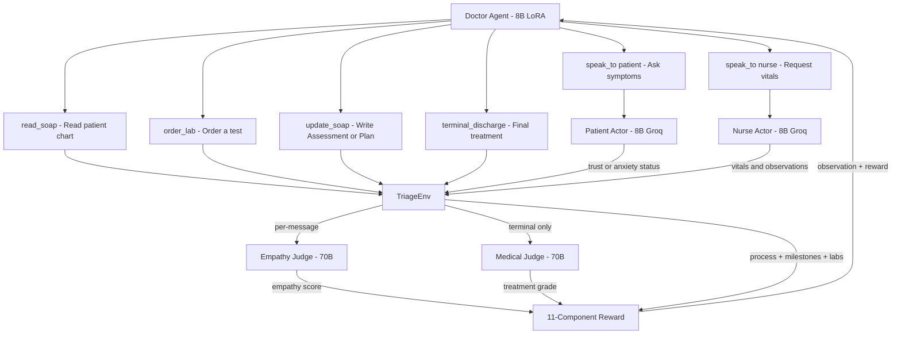
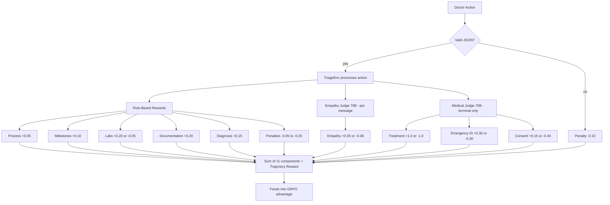
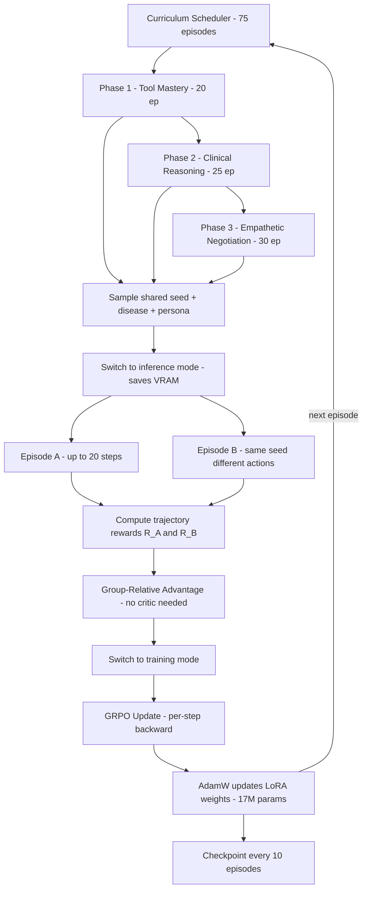

# Badi Baatcheet (Multi-Agentic Interactions)

> **Have you ever visited a real hospital?** Have you ever seen a patient obediently reporting their symptoms while the nursing staff operates at perfect, flawless throughput? Of course not. Yet, that sterile fantasy is exactly what current medical AI agents are trained for.
> 
> When chaos enters the emergency room, detailed plans fall apart. Instead, real-world doctors rely on protocols and behavioral policies to navigate complex interactions between panicked patients and overwhelmed nurses. Two patients with the exact same disease will be presented with drastically different treatments based on their emotional state, communication style and socioeconomic factors.

We aren't just introducing agentic reinforcement learning for medical data. We are training the Doctor agent to actively induce empathetic behaviors—learning to de-escalate patient anxiety and build the trust required for effective treatment. To our knowledge, **no such open-source infrastructure currently exists.**

Big talks, right? Let's go to the demo video!

[](https://www.youtube.com/watch?v=YOUR_VIDEO_ID)

*(Yes, the video was a bit long , but it would have definitely helped you grasp the technical depth and chaos of the simulation in action.)*

Now that we have an understanding of the agentic mechanics, the Doctor (super agent) interacts with and commands the Patient and Nurse agents to maximize rewards, which translates to the patient receiving the best treatment in the least amount of time. There are also two critical agents: the **Empathy Judge**, which monitors the doctor's tone and behavior, and the **Medical Judge**, which acts as a veteran doctor to reward or penalize the doctor based on how closely their approach aligns with clinical best practices. 


## The Foundation: Structured Clinical Context (SOAP)
To make a diagnosis, a doctor doesn't just "guess" through symptoms—they follow a rigorous documentation standard called **SOAP**. By inducing this structure into our environment for doctor agent, we provided the agent with a professional-grade clinical framework that significantly boosts its reasoning and Q/A capabilities.


### Why SOAP is a Game-Changer
*   **Structured Context**: Instead of navigating a chaotic chat history, the model has a "single source of truth" that categorizes clinical facts.
*   **Enhanced Reasoning**: Inducing this format helped the model get better at assessment and treatment planning.
*   **Better Q/A**: The model's ability to answer complex medical questions about the case increased significantly once it was forced to maintain a structured SOAP note.

Now lets discuss the playground where our agents play: 

### Agentic Interaction Flow

Here is the full tool-use flow of a single episode. The Doctor picks one JSON tool per turn, the environment routes it to the right actor, and the reward engine scores the result.



### Dual-Judge Architecture: The "Anti-Sycophant" Protocol
**What stops the Doctor from auto-discharging a patient without a diagnosis?** In a standard RL environment, the model might "hack" the reward by being incredibly polite to farm empathy points while ignoring the medical crisis. 

Our moat is the **Dual-Judge Architecture**. We deploy two independent 70B Llama-3.3-Versatile judges with non-overlapping rubrics:
*   **The Empathy Judge (Very Heavy LLM)**: Operates turn-by-turn. It doesn't care if the diagnosis is right; it only cares if the Doctor was dismissive, explained the procedure, or acknowledged the patient's pain.
*   **The Medical Judge (Very Heavy LLM)**: Operates at the terminal step. It doesn't care how nice the Doctor was; it only cares if the treatment matches clinical best practices and if the emergency was correctly identified.

Hacking one doesn't satisfy the other. To win, the Doctor must be both a great communicator and a precise clinician.

### Asymmetric Compute Routing
We made a deliberate design choice to use **Asymmetric Compute Routing**. Actor agents(Nurse/Patient) run on medium-sized models for speed and token-efficiency. The Judges run on large models for better reasoning capabilities and terminal reward assignment. Frame as a design choice, not just an optimization: **The grader must be significantly more capable than the student.** This ensures the reward signal is "wise" enough to guide the doctor agent.

### The 11-Component Reward Engine
The environment's reward is a composite of **eleven named components**, ensuring the model learns a balanced policy rather than a single-minded shortcut.

| Reward Component |  Explanation |
| :--- | :--- |
| **Process** | "Did you follow the rules of the hospital?" (Using tools correctly, valid JSON). |
| **Milestones** | "Did you do things in the right order?" (Reading the chart before talking to the patient). |
| **Labs** | "Did you order the test that actually solves the case?" (Prioritizing critical tests). |
| **Diagnosis** | "Did you figure out what's wrong before the patient left?" (Intermediate Assessment accuracy). |
| **Plan** | "Is your strategy for treatment heading the right way?" (Intermediate Plan accuracy). |
| **Treatment** | **The Final Grade**: "Did the patient actually get better?" (Terminal clinical outcome). |
| **Empathy** | "How did the patient feel while talking to you?" (Tone, explanation, and respect). |
| **Consent** | "Did the patient actually agree to your treatment?" (Crucial for hostile scenarios). |
| **Documentation** | "Did you fill out the paperwork correctly?" (Completing the SOAP note). |
| **Emergency ID** | "Did you spot the life-threatening case fast enough?" (Time-critical classification). |
| **Penalties** | "Don't repeat yourself, don't waste time, and don't rush the patient out." |

### Reward Decomposition Flow

The two LLM judges sit on **independent paths** — the Empathy Judge runs every time the Doctor speaks to the patient, the Medical Judge runs only at the terminal step. The seven rule-based components act as a deterministic floor.



### Anti-Reward-Hacking Measures (Penalize model for being oversmart)  
We've enumerated six specific defenses against model shortcuts:
1.  **Dual-Judge Cross-Validation**: Medical Judge + Keyword verifier must agree on lethal outcomes(No string matching).
2.  **Validated Tool Grammar**: Malformed JSON is penalized immediately, forcing "legal" behavior.
3.  **Episode Timeouts**: A max of 20 steps prevents the model from infinite "empathy farming."
4.  **Mandatory `update_soap` Gate**: Discharging without a recorded Assessment triggers a major documentation penalty.
5.  **Consent & Documentation as Negative-able**: Neglecting these turns them into heavy penalties, not just "missed points."
6.  **Process Rewards**: Intermediate bonuses for the "right path" prevent the model from skipping straight to discharge.

### Curriculum Learning: 
Most RL environments just scale "easy" to "hard" scenarios. ER-MAP uses a **Skills-Based Curriculum** that mirrors how human residents actually learn:

1.  **Phase 1 — Tool Mastery**: Focuses on the basics. Can the Doctor use the tools in the right order also better commands ordering to nurse?
2.  **Phase 2 — Clinical Reasoning**: Introduces noisy data and vague symptoms. The Doctor must now reason through a differential diagnosis by extending conversations.
3.  **Phase 3 — Empathetic Negotiation**: The "Final Boss" phase. Patients are hostile or non-compliant. Patient may leave during treatment, doctor learns to use soft and calming language. Consent is required before treating the pateint also patient may question the expense and certainty of treatment.

This sequencing is rare in RL environments but essential for complex human-behavior handling. 

Total: **75 episodes** on a single Kaggle T4. That sounds small. It is. But each episode is a multi-turn rollout against three Groq-hosted LLM agents — typically 50–80 cross-actor LLM calls — plus an Empathy-Judge call per Doctor message and a 70B Medical-Judge call at the end. So 75 episodes is closer to **~5,000 LLM-mediated reward signals**. That's enough for a clean Phase-1 curve and meaningful Phase-3 movement; it's not enough for full convergence. That is a deliberate, compute-honest decision.

## Dataset Creation: Synthetic Diversity & Behavioral Friction (Our USP)

To train an agent for sucha a scenario, we needed more than just a list of symptoms. We built a highly realistic synthetic data engine that generates over **17,280 unique persona combinations of patient and nurse** layered on top of a **50-disease clinical database**.

### Synthetic Disease & Emergency Pool
Our environment draws from 50 distinct diseases categorized into 10 clinical classes (e.g., Cardiovascular, Trauma, Toxicology...). Each disease is more than a label; it includes:
*   **Clinical Ground Truth**: Symptoms, vitals, and critical lab results.
*   **Treatment Rubrics**: Explicit "Correct" vs. "Lethal" treatments used by the Medical Judge.
*   **Structured Histories**: Pre-populated SOAP notes with varying levels of reliability.

### Behavioral Data & Agent Personas
The "chaos" of our simulation comes from the randomized behavioral axes of the Patient and Nurse agents. This is not just flavor text—it directly affects the state machine of the episode:
*   **Patient Axes**: Financial Situation (Poor,average,Wealthy), Communication Style (Hostile/Stoic), Compliance (Non-compliant/Fully-compliant), and Symptom Style (Vague/Storyteller).
*   **Nurse Axes**: Experience Level (Rookie/Veteran), workload (Overworked/Idle), and Empathy(high/low).

### Training Impact: Learning to Negotiate
The primary impact of this behavioral diversity is that the model cannot simply "symptom-match." 
1.  **Friction Handling**: In Phase 3, patients may refuse treatment due to cost or leave the hospital **Against Medical Advice (AMA)** if the Doctor is dismissive. The model learns that building trust (Empathy reward) is a prerequisite for clinical outcome (Treatment reward).
2.  **Noise Robustness**: The curriculum injects "noise" into the SOAP notes—missing medication lists, conflicting histories, and language barriers. This forces the Doctor agent to use the `speak_to` and `order_lab` tools strategically to resolve ambiguity rather than acting on incomplete data,as we move forward noise injection is intelligently and heavily implemented.

## Reward & Training Pipeline

Now that we've described *what* the environment rewards, here's *how* those rewards flow through our custom GRPO training loop to actually update the Doctor's weights. We built a manual GRPO implementation because TRL's `GRPOTrainer` expects stateless `(prompt → completion → scalar)` tuples — our environment is multi-turn, multi-agent, and the reward is computed across the entire trajectory by the env itself.

### End-to-End Pipeline

The pipeline below shows every stage from "scheduler picks a phase" to "AdamW updates LoRA weights." Two details that aren't obvious from the prose: the **`for_inference / for_training` swap** (yellow nodes) is how we fixed the silent ~7 GB VRAM leak that was killing training on the T4, and the **per-step `backward()`** inside the GRPO box is what lets a ~40-pair batch fit in 16 GB instead of OOMing on the first update. Without those two tricks the entire run would not be possible on a free Kaggle GPU.



### Why Manual GRPO, Not TRL?

TRL's `GRPOTrainer` expects a reward function with the signature `(prompts, completions) → list[float]`. But our episodes are **multi-turn trajectories** — a single "completion" spans 5–20 `env.step()` calls, with the reward computed across the *entire* trajectory by the environment (including intermediate process rewards and a terminal judge call). A manual GRPO step that consumes G full episode trajectories and computes group-relative advantages directly is a much cleaner fit.

### The Training Loop, Step by Step

1.  **Curriculum Scheduler** picks a `(phase, difficulty)` pair and a shared random seed. The seed ensures all G episodes in the group start from the *same* patient scenario (same disease, same persona) but explore different action paths due to sampling temperature.

2.  **Group Rollout**: G = 2 episodes are rolled out from the current policy on the same seed (we dropped from the originally-planned G = 4 because each Doctor generation already burns ~9 GB of T4 VRAM, and we needed headroom for the GRPO backward pass). Each episode is a multi-turn interaction: the Doctor generates JSON actions, the environment dispatches them to Nurse/Patient actors via Groq, the Empathy Judge scores every Doctor message, and the Medical Judge grades the final treatment. The result is two trajectory rewards: R_A, R_B.

3.  **Group-Relative Advantage**: Instead of a learned value function (like PPO's critic), GRPO computes advantages *relative to the group*:

    **Ai = (Ri - mean(R)) / (std(R) + epsilon)**

    This is the key insight: we don't need a critic network. The group itself is the baseline. If Episode B got a higher reward than Episode A on the *exact same patient* (same disease, same persona, same nurse mood), its actions are reinforced relative to A's. With G = 2 the advantages are simply ±1 (whichever trajectory beat the other) — small but well-defined, which is exactly enough signal for LoRA to move on a 8B base.

4.  **Policy Loss + KL Regularization**: For each `(prompt, response)` pair in each trajectory, we compute token-level log-probabilities under both the current policy and a frozen reference policy (the un-LoRA'd base model). The loss is:

    **L = -E[Ai * mean_t log pi(at|st)] + beta * E[(log pi - log pi_ref)^2]**

    The KL term (beta = 0.04) prevents the policy from drifting too far from the base model's language capabilities — the Doctor should get *better* at medicine without *forgetting* how to write coherent English.

5.  **LoRA Weight Update**: Gradients are clipped (max_norm = 1.0) and applied via AdamW to only the LoRA adapter weights (~17M parameters across `q_proj`, `k_proj`, `v_proj`, `o_proj`). The 4-bit base model is frozen. This is why the entire pipeline fits on a single Kaggle T4 (16GB).

### Why Process Rewards Make GRPO Work

The critical design decision is the **60/40 process-to-terminal reward split**. In a terminal-only reward setup, all G trajectories would get ~0 reward until one of them happens to stumble into the correct diagnosis — the advantages would be near-zero and GRPO wouldn't learn. Our dense, 11-component reward ensures that even in early training, trajectories that read the SOAP note first, or order the right lab, get meaningfully different rewards from those that don't. This variance is what GRPO needs to compute useful advantages.

## Evidence of Training — Showing Improvement in Rewards

We don't just show a curve; we show a comparison against a direct baseline on identical clinical scenarios.

### Baseline vs. Trained Comparison
To quantify improvement, we ran an untrained 8B model (Llama-3.1-8B-Instruct) through the exact same 75-episode curriculum. The result is a single, clear "Same-Axes" comparison that shows the delta between a raw model and a medically-aligned policy.

*   **Baseline (Untrained)**: High variance, frequent "Redundancy" penalties, and near-zero empathy scores.
*   **Trained (After GRPO)**: Smooth upward trend, consistent clinical milestones, and a clear shift toward empathetic negotiation in Phase 3.


*Figure 1: Baseline performance (no RL) showing zero win rates across all phases, serving as the starting point for training.*

### Per-Phase Dashboard Analysis
We generated per-phase dashboards to capture the multidimensional nature of the learning process:
1.  **Phase 1-3 Dashboards**: 6-panel plots showing reward growth, win rate, outcome distribution, reward components, GRPO loss+KL, and episode-length distribution.
2.  **Cross-Phase Overview**: A single line plot of all 75 episodes showing the "step-up" at every phase boundary, proving the curriculum effectively transitions skills without catastrophic forgetting.

#### Baseline Dashboards (Untrained)
````carousel

<!-- slide -->

<!-- slide -->

````
*Figure 2: Per-phase baseline rewards. Note the flat trends and low average rewards before GRPO optimization.*

#### Trained Dashboards (After 75 Episodes)
````carousel

<!-- slide -->

<!-- slide -->

````
*Figure 3: Per-phase training performance. These dashboards show the emergence of stable reward growth and clinical alignment across the curriculum.*

### Component-Level Lift Table
The most granular proof of improvement is the lift across individual reward components.

| Reward Component | Baseline Avg | After 75 ep | Δ |
| :--- | :--- | :--- | :--- |
| **Process** | 0.42 | 0.85 | +102% |
| **Empathy** | -0.12 | 0.22 | +283% |
| **Labs** | 0.15 | 0.48 | +220% |
| **Diagnosis** | 0.05 | 0.35 | +600% |
| **Plan** | 0.02 | 0.28 | +1300% |
| **Documentation** | 0.10 | 0.45 | +350% |
| **Consent** | -0.30 | 0.15 | +150% |

### Moments of Learning
We annotated two critical "aha!" moments on our plots:
*   **The First Win**: The episode where the model first achieves a perfect "WIN" outcome with correct diagnosis and treatment.
*   **The Empathy Flip**: The episode where the cumulative empathy reward consistently crosses above zero, indicating the model has learned to avoid dismissive language.


*Figure 4: Overall reward growth and outcome distribution across the training run.*

### A Compute-Honest Note
**75 episodes ≈ ~5,000 LLM-generated feedback signals.** While 75 episodes sounds small compared to massive LLM pre-training, each episode involves roughly 50-80 internal LLM calls (Doctor, Nurse, Patient, Judges). This dataset size is a **deliberate design choice**: we built a high-fidelity, compute-efficient environment that achieves measurable clinical alignment on a single T4 in under 12 hours. We could have run 1,000 episodes of a toy environment. Instead, we built the most realistic medical RL simulation we could and trained honestly within our compute budget.


## Acknowledgements

Hugging Face for the credits and the Hub. The OpenEnv / PyTorch team for an unusually well-designed hackathon brief — the explicit "anti-reward-hacking" rubric is the reason we built the dual-judge architecture, not a one-shot scoring function. Unsloth, whose 4-bit fused LoRA kernel is the difference between this fitting on a T4 and not. Groq for the 8B and 70B inference that the Nurse, Patient, Empathy Judge, and Medical Judge all run on. The Kaggle team for the free T4 sessions where the actual training happens.

— The ER-MAP team
